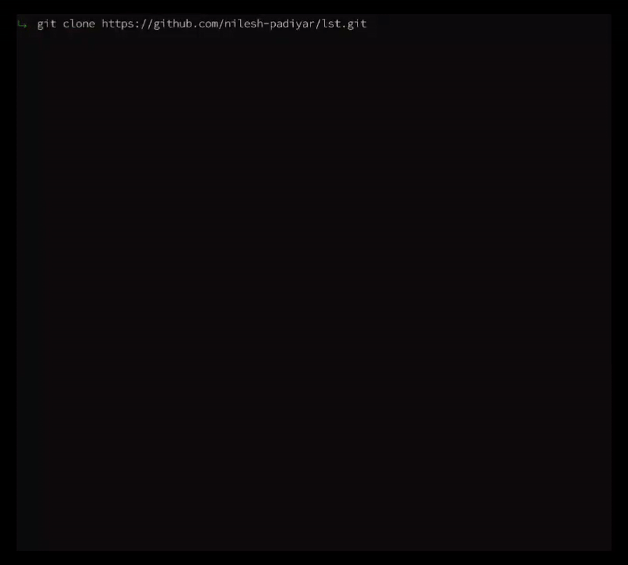

# lst

> A simple `ls` clone built from scratch to learn C and UNIX APIs.

`lst` is a small command-line utility that displays directory contents in a simple format directly in your terminal.

Built as a learning project, lst focuses on simplicity, readability, and understanding low-level filesystem traversal in C.

This project exists purely for learning. The goal is to understand how a command like `ls` works internally by building it from scratch using C and UNIX system APIs, rather than relying on existing implementations.

---

## Demo



---

## Features

- List directory contents
- Accept custom directory paths
- Hide hidden files by default
- Display hidden files with `-a`
- `--help` / `-h` support
- Install with `make install`

---

## Project Structure

```text
lst/
 ├── assets/
 │   └── demo.gif
 ├── src/
 │   └── main.c
 ├── Makefile
 ├── README.md
 ├── LICENSE
 └── .gitignore
```

---

## Installation

### Build from Source

#### Requirements

* GCC
* GNU Make

#### Clone the Repository

```bash
git clone https://github.com/nilesh-padiyar/lst.git
cd lst
```

#### 1. Build and Run

```bash
make
./lst
```

#### 2. Install System-Wide (Optional)

```bash
sudo make install
```

After installation:

```bash
lst
```

can be executed from anywhere.

Uninstall:

```bash
sudo make uninstall
```

> If you prefer a different compiler (such as Clang), change the CC variable in the Makefile before building.

---

## Usage

```bash
lst
```

List the current directory.

```bash
lst src
```

List a specific directory.

```bash
lst -a
```

Show hidden files and directories.

```bash
lst -a src
```

Show hidden files in a specific directory.

```bash
lst --help
```

Display the help message.

---

## Roadmap

- [x] List current directory
- [x] Support custom paths
- [x] Hide hidden files by default
- [x] Add `-a`
- [ ] Implement `-l`
- [ ] Sort output
- [ ] Colorized output

---
## Current Status

lst is currently in pre-release and under active development.

The project is functional but still evolving as new features and improvements are added.

---

## Author

**Nilesh Padiyar**

---
